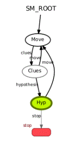

# Experimental Robotics Laboratory - Assignment 1

## Jacopo Ciro Soncini 5050695

### Preliminary actions

The package is containing the onthology used by the SherlockBot, but it will need to be paired with the Armor package Professor Luca Buoncompagni and Alessio Capitanelli developed,
downloadable at https://github.com/EmaroLab/armor. 

### Content description

* Cluedo onthology: onthology given in the assignment and used for reasoning
* CMakeLists.txt: the cmake file of the package
* package.xml: the XML file describing the package requisites
* Doxyfile: file used to generate the documentation
* Docs: folder containing the documentation
* launch: folder containing the launch file (launch.launch) to run every node needed by the robot (not working for now)
* msg: folder containing the custom message (Hint.msg) used by the "hint_publisher" node.
* scripts: folder contaning the four main scripts (hint_publisher.py, hypothesis_maker.py, oracle_service.py and state_machine.py).
* srv: folder containing the custom services (Hypothesis.srv and oracle.srv) used by the "hypothesis_maker2" node and the "oracle" node.

### State machine graph


This image shows the different states initialized with the state machine.

### RQT graph


Depending on the state of the state machine different nodes are communicating.

### Compiling and running

To compile the package you need to clone it in your ros workspace and then run the command 
```
catkin_make
```
Then you need to run the command 
```
roslaunch exp_rob_lab launch.launch
```
and this should launch all the nodes that are needed, including the armor service.

In case this doesn't work, or if you want to check how the robot works with more feedback, you may need to launch every single node individually by running
``` 
roscore
```
add '&' to run it in background
```
rosrun armor execute it.emarolab.armor.ARMORMainService 
```
**be careful! You must have downloaded the armor package linked in the Preliminary actions and the package must be called armor**
```
 rosrun exp_rob_lab hint_publisher.py 
```
```
 rosrun exp_rob_lab oracle_service.py
```
```
 rosrun exp_rob_lab hypothesis_maker.py
```
```
 rosrun exp_rob_lab state_machine.py
```

### Robot behaviour 
The robot should move into a room (simulated movement) where he collects a hint and adds hit to the onthology. The robot will keep moving while he searches for more hint, until it has enough to formulate a complete hypothesis. This behaviour is handled with two different states, one for movement and one for hint collection.

After the robot has a complete hypothesis in its database, it will move to the terminal to tell the oracle its answer. The oracle will say to the robot wether the hypothesis is correct. If it is the state machine will stop, otherwise the robot will go back to hint collection.

### Architectural choices made

I decided to use a custom publisher for giving the hint to the robot and two custom services, one for the oracle and one for the hypothesis maker. This allowed me to pass every information I might have needed between the nodes.
I also opted for 3 states instead of two as it allowed my state machine to be more easily adaptable if I needed to program a real movement in a map.

### Limitations and possible imporvements

The robot is really "dumb" as it does not remember if the hypothesis he formulated was already given to the oracle.

The movement is poorly handled as I just stop the script for certain amount of time. This would make it seems like the robot is always travelling the same amout of distance and this is not really plausible. 


