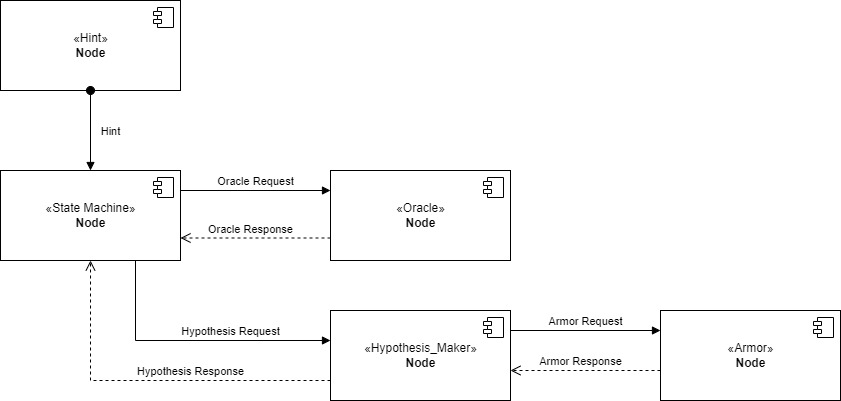
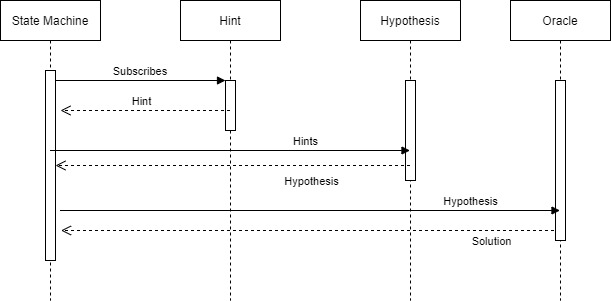
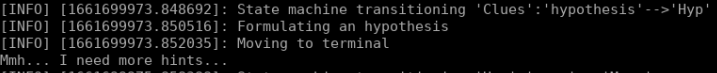
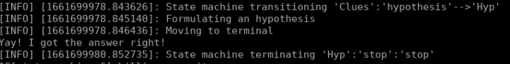

# Experimental Robotics Laboratory - Assignment 1

# Jacopo Ciro Soncini 5050695
E-mail: jacopo.soncini@gmail.com

# Brief introduction
The project implements a game of cluedo. This is a first simulation where all of the action are simulated but the updating of the onthology. The robot collects hints and sends them to the armor service that returns any complete hypothesis. Then the robot return home and checks if the hypothesis is correct. In this implemenation hint are all correct and building an incosistent hypothesis should be impossible.

# Preliminary actions

The package is containing the onthology used by the SherlockBot, but it will need to be paired with the Armor package Professor Luca Buoncompagni and Alessio Capitanelli developed, downloadable at https://github.com/EmaroLab/armor. 

# Software Architecture
SherlockBot is handled with a finite state machine and 3 nodes that handle hints, hypothesis and the oracle. The state machine sets the behaviour of the robot and communicates with different services or subscribers. More on the system architecture to be explained with the graphs, first I will explain the contents of the package.
The package is composed of:
- One launch file:
    - launch.launch
- One custom message file:
    - Hint.msg
- Two custom service files:
    - Hypothesis.srv
    - oracle.srv
- Four nodes:
    - hint_publisher.py
    - hypothesis_maker.py
    - oracle_service.py
    - state_machine.py

## Custom messages and services
### Hint message
The message is composed of three string: id, name and class. These are needed to be readable from armor service and upload them correctly on the onthology.

>string id
>string name
>string class_id

### Hypothesis service
The request has the same format as the Hint message. The response is composed of 3 strings (id, who, what, where) and 1 boolean value (consistent). This service is called every time i upload one hint and return any complete hint, with a boolean value that checks if it is consistent.
**Request**
>string id

>string name

>string class_id
**Response**
>string id
>string who
>string where
>string what
>bool consistent

### oracle service 
The request is a string with the id of the hypotesis. The response is an int32 value that checks if the hypothesis is correct.
**Request**
>string id

**Response**
>int32 right

## Nodes
### hint_publisher.py
This node generates random hint from an array of hints and, using a ROS publisher, sends them to whoever subscribes. There are 18 different hint divided in 6 identifiers, each one is consistent.
### hypothesis_maker.py
This node is the one tasked with communicating with the armor service and updating the onthology. It receives the hints and adds them to the onthology, then it checks if there is a complete hypothesis. In case there is it returns the complete hypothesis, otherwise is returns an empty message.
### oracle_service.py
This node is tasked with checking if the complete hypothesis is the correct one. It does so by simply checking if the hypotesis' id is "HP3" or whatever the user sets.
### state_machine.py
This node is the central node and handles the behaviour of the robot, basing it off of states. There are 3 states: move, clues and hyp. The first one handles the movement of the robot to a random room, the second one collects hints and the last one checks if the hypothesis formulated is correct.
## Architecture diagram



As we can see the architecture is composed of 5 nodes. The central one is the state machine, which subscribes to the hint publisher and call the services in hypothesis_maker and oracle. 
The hypothesis maker node also call the service in armor, in order to update the cluedo onthology.
## State Machine


The state machine has 3 states: move, clues and hyp. The machine starts in the move state, from which will move to the clues state.
The clues state has two possible outputs, based on if the received hypothesis is complete or not. If the hypothesis is complete then it will go to the hyp state, to check if it is correct. Otherwise the machine will return to the move state to collect more hints.
The hyp state has two outcomes, if the hypothesis is correct then the game ends, otherwise the machine returns to the move state, to collect more hints.
## Temporal sequence diagram


This image shows a temporal sequence diagram for the simulation, in case every output is ok at the first run. Probably the state machine will be called again and again but the number of times is not fixed, so it is not represented.
The state machine starts with the move state, making the robot move to a clue. Then, when it changes to the clues state the robot subscribes to a publisher and reads the hint. In this state, but at a different time, it also calls the hypothesis maker service, to add the hint to the onthology and then it checks for a complete hypothesis. Assuming the hypothesis is complete the robot goes to the oracle state where it moves to the terminal and check if the hypothesis is correct, which if it is will be the last action done.
# Installation and Running Procedure
To install this package, assuming you have installed the armor package as indicated in the above link (don't forget to run the `./gradlew deployApp` command in the armor folder), you will need to just clone the github repository in your ros workspace, move to the correct branch and build it. 
in <your_ros_workspace>/src run:
```
git clone https://github.com/jacopociro/exp_rob_lab.git
git checkout ass1
cd ..
catkin_make
```
When this is done, hopefully with no errors, just run
```
roslaunch exp_rob_lab launch.launch
```

# Running code
The simulation is really simple, as all of the actions are simulated in this stage. The only output we have is text on the terminal.
### Move state


This is the move state output, where the robot moves to a random room. 
### Clues state
The robot is now in the clues state where it collects hint and returns the formulated hypothesis
This can be incomplete:


or complete:


### Oracle state
THis state checks if the hypothesis is incorrect, in which case returns to the move state:



or correct, in which case stops the program:



# Working Hypothesis and Environment
The environment is as simple as it can be, in order to be easily changed and improved in the next two assignments. In this implementation the enviroment is totally simulated, the robot has a few simulated action that should be able to easily changed into real actions. All of the variable are defined by the author, such as hints and the correct hypothesis.
## System's Features
The system is easily adaptable to changes, as it is pretty modular and each script handles the different parts of the algorithm. 
The system can also handle random hints, even though the need to be properly written. If the hint is not proper the system should just ignore them.

## System's Limitations
The system is not designed to handle malformed hint or to discard incosistent hints. 
To change the hitns and the solution the user needs to have some programming knowledge.
The onthology is not readable when it gets updated.
The output is not easy to read.
## Possible Techinical Imporvements
A good improvment would be the implementation of malformed hints and incosistent hypothesis, to check if the program can handle it. 
Also it would be good to have easier way to check the output of the various scripts.
The last obious improvment would be to have actual action instead of simulated ones