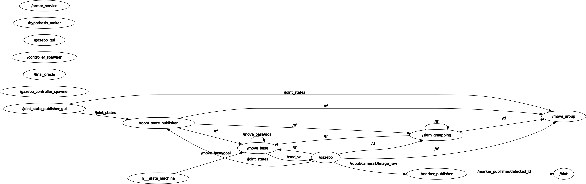

# Experimental Robotics Laboratory - Assignment 3

# Jacopo Ciro Soncini 5050695
E-mail: jacopo.soncini@gmail.com

# Brief introduction
The project implements a game of cluedo. This simulation is the closest to a possible real world implementation. The robot collects hints and sends them to the armor service that returns any complete hypothesis. Then the robot return home and checks if the hypothesis is correct. In this implemenation hints could be malformed and building an incosistent hypothesis is a possibility.

# Preliminary actions

The package is containing the onthology used by the SherlockBot, but it will need to be paired with the Armor package Professor Luca Buoncompagni and Alessio Capitanelli developed, downloadable at https://github.com/EmaroLab/armor.
You will need to also download my moveit package at https://github.com/jacopociro/moveit.git, the move base action at https://github.com/ros-planning/navigation.git, the aruco pacakge at https://github.com/CarmineD8/aruco_ros.git and the starting package for the assignment at https://github.com/CarmineD8/exp_assignment3.git.
All the packages need to be downloaded in your_ros_workspace/src.

# Software Architecture
SherlockBot is handled with a finite state machine and 2 nodes that handle hints and hypothesis. The oracle is handled in antoher package. The state machine sets the behaviour of the robot and communicates with different services or subscribers. More on the system architecture to be explained with the graphs, first I will explain the contents of the package.
The package is composed of:
- One launch file:
    - launch.launch
- One custom message file:
    - Hint.msg
- Two custom service files:
    - Hypothesis.srv
    - oracle.srv
- Four nodes:
    - hint_publisher.py
    - hypothesis_maker.py
    - oracle_service.py
    - state_machine.py

## Custom messages and services
### Hint message
The message is composed of three string: id, name and class. These are needed to be readable from armor service and upload them correctly on the onthology.

>string id

>string name

>string class_id

### Hypothesis service
The request has the same format as the Hint message. The response is composed of 3 strings (id, who, what, where) and 1 boolean value (consistent). This service is called every time i upload one hint and return any complete hint, with a boolean value that checks if it is consistent.
**Request**
>string id

>string name

>string class_id

**Response**
>string id

>string who

>string where

>string what

>bool consistent

### oracle service 
The request is a string with the id of the hypotesis. The response is an int32 value that checks if the hypothesis is correct.
**Request**
>string id

**Response**
>int32 right

## Nodes
### hint_publisher.py
This node reads random hint from an aruco marker and, using a ROS service, sends them to /hypothesis_maker.
### hypothesis_maker.py
This node is the one tasked with communicating with the armor service and updating the onthology. It receives the hints and adds them to the onthology, then it checks if there is a complete hypothesis. In case there is it returns the complete hypothesis, otherwise is returns an empty message.
### state_machine.py
This node is the central node and handles the behaviour of the robot, basing it off of states. There are 3 states: move, clues and hyp. The first one handles the movement of the robot to a random room, the second one look for hints and the last one checks if the hypothesis formulated is correct.
## Architecture diagram




As we can see the architecture is composed of various nodes. The central one is the state machine, which subscribes to the /complete publisher and call the services to the moveit package, the gazebo simulation and oracle_solution. 
The hypothesis maker node also call the service in armor, in order to update the cluedo onthology and communicates with the hint publisher node. This node has to communicate with both aruco and the simulation node to read the hint; lastly it will communicate to the state machine when we have a complete and consistent hypothesis.
## State Machine


The state machine has 3 states: move, clues and hyp. The machine starts in the move state, from which will move to the clues state.
The clues state has two possible outputs, based on if the received hypothesis is complete or not. If the hypothesis is complete then it will go to the hyp state, to check if it is correct. Otherwise the machine will return to the move state to collect more hints.
The hyp state has two outcomes, if the hypothesis is correct then the game ends, otherwise the machine returns to the move state, to collect more hints.
## Temporal sequence diagram


This image shows a temporal sequence diagram for the simulation, in case every output is ok at the first run. Probably the state machine will be called again and again but the number of times is not fixed, so it is not represented.
The state machine starts with the move state, making the robot move to a clue. Then, when it changes to the clues state the robot looks around to find and read the hint. During this function, but at a different time, it also calls the hypothesis maker service, to add the hint to the onthology and then it checks for a complete hypothesis. Assuming the hypothesis is complete the robot goes to the oracle state where it moves to the terminal and check if the hypothesis is correct, which if it is will be the last action done.
# Installation and Running Procedure
To install this package, assuming you have installed the armor package as indicated in the above link (don't forget to run the `./gradlew deployApp` command in the armor folder), you will need to just clone the github repository in your ros workspace, move to the correct branch and build it. 
in <your_ros_workspace>/src run:
```
git clone https://github.com/jacopociro/exp_rob_lab.git
git checkout assignment3
cd ..
catkin_make
```
When this is done, hopefully with no errors, just run
```
roslaunch exp_rob_lab launch.launch
```

# Running code
The simulation might take a very long time to complete.


This images show how the simulation is represented on gazebo and rviz.

https://youtu.be/GTX7jYbu5oQ

At this link you can checkout the most interesting action, where the robot looks around during the look for clues function.

# Working Hypothesis and Environment
The environment is as modualar as possibile, to make the system as adaptable as possible. In this implementation the enviroment is totally simulated on gazebo and rviz, where all of the action are represented. All of the variable are given to the author.
## System's Features
The system is easily adaptable to changes, as it is pretty modular and each script handles the different parts of the algorithm. 
The system can also handle malformed hints and incosistent hypothesis. 

## System's Limitations
To change the hints and the solution the user needs to have some programming knowledge.
The onthology is not readable when it gets updated.
The output is not easy to read.
The simulation is rather slow
## Possible Techinical Imporvements
The simulation could be optimized, both in how the action work and the algorithm is implemented.
A better way to indetify the hint, maybe with a better camera and a better algorithm, might make the simulation shorter.
Also it would be good to have easier way to check the output of the various scripts.
