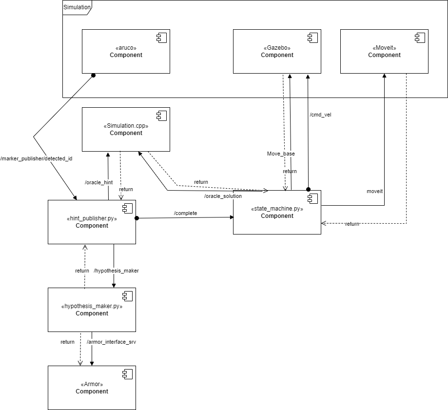

# Experimental Robotics Laboratory - Assignment 2

# Jacopo Ciro Soncini 5050695
E-mail: jacopo.soncini@gmail.com

# Brief introduction
The project implements a game of cluedo. In this project the simulation is a simple room with 4 points to collect the hints, the behaviour is handled with a ROSplan and the actions have a meaning in the physical world. The robot collects hints and sends them to the armor service that returns any complete hypothesis. Then the robot return home and checks if the hypothesis is correct. In this implemenation hint can be malformed and building an incosistent hypothesis is possible.

# Preliminary actions

The package is containing the onthology used by the SherlockBot, but it will need to be paired with the Armor package Professor Luca Buoncompagni and Alessio Capitanelli developed, downloadable at https://github.com/EmaroLab/armor. 
To run this package you will also need to download the ROSPlan package at https://github.com/KCL-Planning/ROSPlan.git . 
Lastly you will need to download my moveit package at https://github.com/jacopociro/moveit.git

# Software Architecture
SherlockBot is handled with ROSPlan and 10 nodes that handle hints, hypothesis, the oracle and the actions. The plan.py handles the various part of ROSplan, updating the knowledge as requested. More on the system architecture to be explained with the graphs, first I will explain the contents of the package.
The package is composed of:
- One action file:
    - Move.action
- Two config files:
    - motors_config.yaml
    - sim.rviz 
- Four launch files:+
    - assignment.launch
    - launch.launch
    - plan.launch
    - spawn.launch
- Two custom message file:
    - ErlOracle.msg
    - Hyp.msg
- Two custom service files:
    - Hypothesis.srv
    - Oracle.srv
- PDDL plan:
    - auto_problem.pddl
    - domain.pddl
    - plan.pddl
    - problem.pddl
- Ten nodes:
    - go_to_point_action.py
    - hypothesis_maker.py
    - plan.py
    - add_to_onthology.cpp
    - check_oracle.cpp
    - got_to_waypoint.cpp
    - hypothesis_check.cpp
    - leave_home.cpp
    - return_home.cpp
    - simulation.cpp

## Custom messages, action and services
### Move action
The action is composed of:
**Request**
>geometry_msgs/PoseStamped target_pose

**Response**
>geometry_msgs/Pose actual_pose

>string stat


### ErlOracle message
The message is composed of one int32: id and two strings: name and class. These are needed to be readable from armor service and upload them correctly on the onthology.

>int32 id

>string name

>string class_id

### Hyp message
The message is composed of 4 strings: id, who, where, what, consistent.

>string id

>string who

>string where

>string what

>bool consistent

### Hypothesis service
The request has the same format as the Hint message. The response is composed of 3 strings (id, who, what, where) and 1 boolean value (consistent). This service is called every time i upload one hint and return any complete hint, with a boolean value that checks if it is consistent.
**Request**
>string id

>string name

>string class_id

**Response**
>string id

>string who

>string where

>string what

>bool consistent

### Oracle service 
The request is empty. The response is an int32 value that returns the ID.
**Request**
None

**Response**
>int32 ID

## PDDL
### Domain
This file describes the domain for the pddl. 
### Problem
This file describes the problem for the pddl. 
### Plan
This file contains the plan the ROSPlan compiled by the ROSPlan.
### Auto Problem
This file contains the problem compiled by the pddl.

## Nodes
### hypothesis_maker.py
This node is the one tasked with communicating with the armor service and updating the onthology. It receives the hints and adds them to the onthology, then it checks if there is a complete hypothesis. In case there is it returns the complete hypothesis, otherwise is returns an empty message.
### go_to_point_action.py
This node is the node tasked with making sure that the robot reaches the goal, both in orientation and position.
The behaviour is handled with 3 states. The first one is tasked with aiming for the goal, using angular velocities. 
The second state makes sure the robot reaches the goal, giving linear velocities. The last state handles the orientation
given with the goal, using angular velocities. The angular and linear velocities are published on the /cmd_vel publisher.
The goal is handled with the /reaching_goal action. On the /odom subsciber the node reads the robot position.
### plan.py
This node handles the ROSPlan services, updating the knowledge as needed with every new plan.
### add_to_onthology.cpp
This program implements the real action to be completed when the planner dispatches the action add to onthology. It also calls the needed service, publisher and subscriber.
### check_oracle.cpp
This program implements the real action to be completed when the planner dispatches the action check_oracle. It also calls the needed subscriber.
### go_to_waypoint.cpp
This program implements the real action to be completed when the planner dispatches the action go_to_waypoint.
### hypothesis_check.cpp
This program implements the real action to be completed when the planner dispatches the action hypothesis_check.
### leave_home.cpp
This program implements the real action to be completed when the planner dispatches the action leave_home.
### return_home.cpp
This program implements the real action to be completed when the planner dispatches the action return_home.
### simulation.cpp
This program implements the simulation for the assignment, the generation of hints and the server for the correct the hypothesis.

## Architecture diagram



The architecture is kind of complicated but can be divided in four parts: gazebo simulation, ROSplan, moveit and armor.
ROSplan is called by plan.py and handles the behaviour of the robot, calling the ROSplan Actions.
The simulation is handled by the simulation.cpp and is used by go_to_point_action.py. fundamental for all of the movement ROSplan actions(go to waypoint, leave home and return home).
Armor is handled by hypothesis_maker.py which is called by the add to onothology action.
Moveit is handled by the moveit package, is called by add to onthology to move the arm planning group.
## Plan


This is an example of a plan for the robot.
In the domain file we can see the definition of the various predicates and actions.
In the problem file we can see the starting situation and the goal.
The plan get updated everytime an action fails, only hypothesis check and check oracle can fail.
## Temporal sequence diagram


This image shows a temporal sequence diagram for the simulation, in case every output is ok at the first run. Probably the plan will be updated again and again but the number of times is not fixed, so it is not represented.
The plan gets computed and run the first action (this could be leave home or go to waypoint). From here the robot add the reiceved hint to the onthology and checks for a complete hypothesis. In case it is complete it will move home and check the oracle for the correct solution. In case it is the correct solution the robot will stop in the home position.

# Installation and Running Procedure
To install this package, assuming you have installed the packages as indicated in the above chapter (Preliminary actions), you will need to just clone the github repository in your ros workspace, move to the correct branch and build it. 

In <your_ros_workspace>/src run:
```
git clone https://github.com/jacopociro/exp_rob_lab.git
git checkout ass2
cd ..
catkin_make
```
When this is done, hopefully with no errors, just run
```
roslaunch exp_rob_lab launch.launch
```

# Running code


THis is a brief example of how the robot moves and reaches the hint.


This is the position of the hint on the map.

Basically, during the simulation, the robot moves between the 4 points, collecting hint with the arm and adding them to an hypothesis. THen shoerlock bot, when has at least 3 hints, checks if the hypothesis is complete and consistent and in case it is returns home. If the hypothesis is not complete or not consistent the robot replans and starts following the new plan, after having updated the knowledge. When sherlock bot gets home it contatcs the oracle to know if the hypothesis is correct and if it is stop the simulation. Otherwise it will replan and start following the new plan, with an updated knowledge.
The simulation might take a long time to complete.
# Working Hypothesis and Environment
The architecure is as modular as it can be, to be easily adptable. In this implementation we have a simple map, the robot has only real actions. Hints and correct solution are given to the author and I had to work with them, changing my last implementation to fit them
## System's Features
The system is easily adaptable to changes, as it is pretty modular and each script handles the different parts of the algorithm. 
The system can also handle random hints, even the malformed ones.
The system has a planning algorithm, which makes it reactive and robust. The planning algorithm, if properly adapted can handle more complex problems than the one implemented in the project. The knowledge update is also done in such a way to implement the fastest response when planning.

## System's Limitations
To change the hitns and the solution the user needs to have some programming knowledge.
The onthology is not readable when it gets updated.
The output is not easy to read.
The simulation could be faster.

## Possible Techinical Imporvements 
It would be good to have easier way to check the output of the various scripts.
The simulation could be faster if the go to point algorithm and the moveit plans were optimized. Another way to make the simulation faster could be to have the add to onthology action to fail when it encouters a malformed hint, in order to not update the armor onthology with useless information.